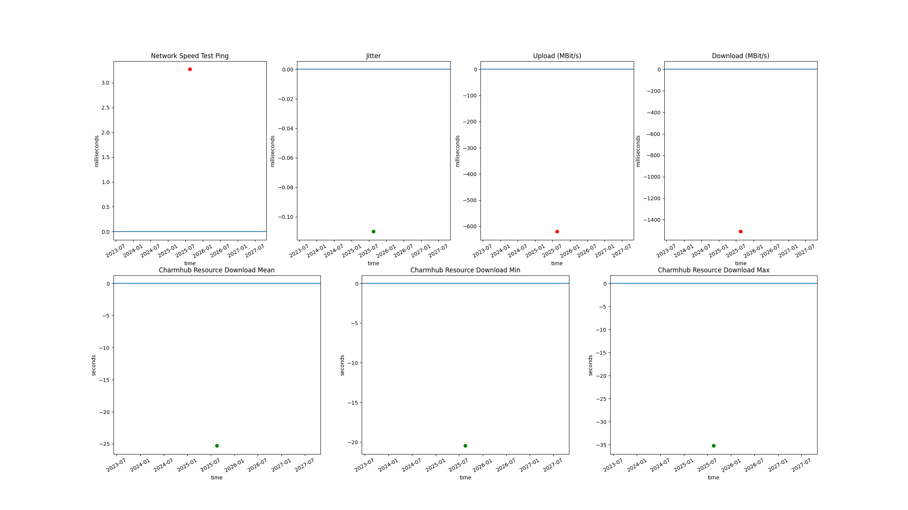
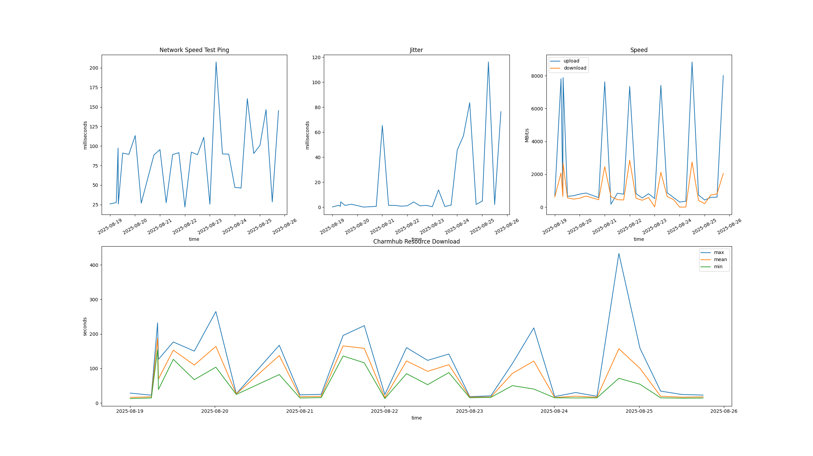

# GitHub Runner Benchmark Results

This page shows performance benchmarks comparing the GitHub and self-hosted runners.

The tests run periodically throughout the day and test the networking performance. There are 2
tests that are executed, a speedtest using
[librespeed-cli](https://github.com/librespeed/speedtest-cli) and a download test of a resource
from Charmhub.

## Self vs GitHub Hosted Performance

The following chart shows relative performance of the self-hosted versus GitHub hosted runners.
Each point of the graph shows the relative performance of self versus GitHub hosted. For example,
if a point is marked as zero, then for a given chart and point in time, the self and GitHub
hosted runners performed the same. The differences are primarily driven by the underlying
infrastructure each of the runners is hosted on.

Each point on the graph is either red or green. If a point is red, it means that the self hosted
runners performed worse and if a point is green, the self hosted runners performed better than the
GitHub hosted runners. The values are computed by subtracting the GitHub hosted result from the
self hosted result. For time based tests, such as the ping, jitter and Charmhub resource download
tests, a positive value indicates the self hosted runners performed worse than the GitHub hosted
runners. For speed based results, such as the download and upload tests, a negative value
indicates the self hosted runners performed worse than the GitHub hosted runners.

## Runner Type Results

For each type of runner below, there are two rows of charts. The first row shows the speed test
and the second row shows the Charmhub resource download result. Each point on the chart
represents a result at a given time. All tests are point in time so not continuous.

For the speedtest row, the first chart for the speedtest is the ping in milliseconds and the
second chart shows the jitter also in milliseconds. The third chart shows the download and upload
speed in MBit/s. These charts show the health of the networking.

For the Charmhub resource download row, the chart shows the minimum, mean and maximum download
time in seconds for a resource from Charmhub. This chart should be compared over time as
variations in how long resources take to download has an impact on the consistency of job
execution.

### Self Hosted AMD64

[CSV results](results/v1/self-hosted-amd.csv)

### Self Hosted ARM64

[CSV results](results/v1/self-hosted-arm.csv)

### GitHub Hosted

[CSV results](results/v1/github-hosted.csv)
