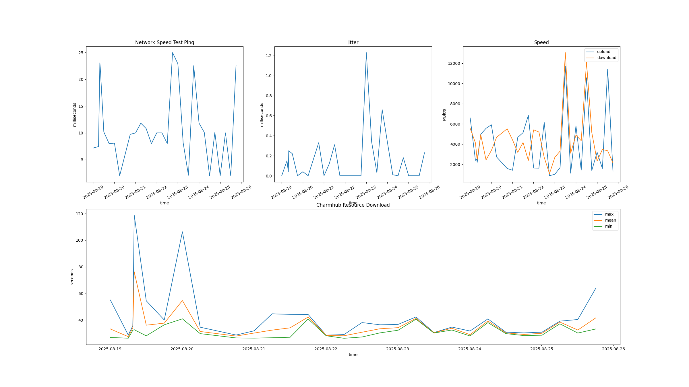

# GitHub Runner Benchmark Results

This page shows performance benchmarks comparing the GitHub and self-hosted runners.

The tests run periodically throughout the day and test the networking performance. There are 2
tests that are executed, a speedtest using
[librespeed-cli](https://github.com/librespeed/speedtest-cli) and a download test of a resource
from Charmhub.

For each type of runner below, there are two rows of charts. The first row shows the speed test
and the second row shows the Charmhub resource download result.

For the speedtest row, The first chart for the speedtest is the ping in milliseconds and the
second chart shows the jitter also in milliseconds. The third chart shows the download and upload
speed in MBit/s. These chart shows the health of the networking.

For the Charmhub resource download row, the chart shows the minimum, mean and maximum download
time in seconds for a resource from Charmhub. This chart should be compared over time as
variations in how long resources take to download has an impact on the consistency of job
execution.

## Self Hosted AMD64

[CSV results](results/v1/self-hosted-amd.csv)

## Self Hosted ARM64

[CSV results](results/v1/self-hosted-arm.csv)

## GitHub Hosted

[CSV results](results/v1/github-hosted.csv)
